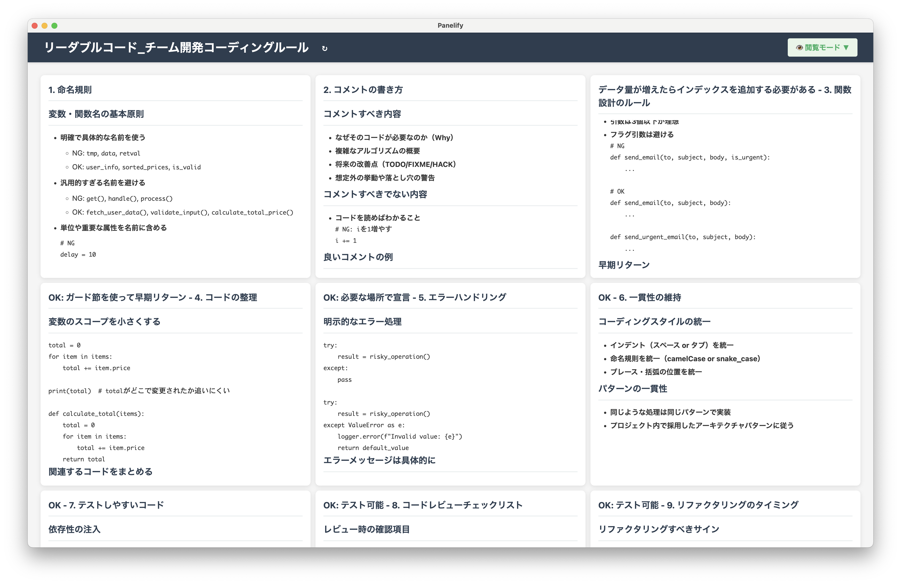

# Panelify

MarkdownファイルをグリッドベースのダッシュボードUIに変換するElectronアプリケーションです。



## 特徴

- 📝 **Markdownサポート**: H1/H2見出しでセクションを自動分割
- 🎯 **Obsidian連携**: Obsidianファイルに最適化された設計
- 🔧 **カスタマイズ可能**: ドラッグ&ドロップでレイアウトを自由に変更
- 💾 **設定保存**: ファイルごとにレイアウト設定を自動保存
- 📂 **最近使用したファイル**: 履歴から素早くファイルにアクセス
- 🔄 **リアルタイム更新**: ファイル再読み込み機能

## インストール

### リリース版（推奨）
1. [Releases](../../releases)ページから最新版をダウンロード
2. プラットフォームに応じたファイルをダウンロード
3. インストーラーを実行

### ソースからビルド
```bash
git clone https://github.com/kyokomi/Panelify.git
cd Panelify
npm install
npm run build
npm start
```

## 使い方

### 基本操作

1. **ファイルを開く**: 「ファイルを開く」ボタンでMarkdownファイルを選択
2. **レイアウト編集**: 「編集モード」に切り替えてパネルをドラッグ&リサイズ
3. **レイアウト保存**: 変更後「レイアウト保存」で設定を永続化
4. **ファイル再読み込み**: Markdownファイルが更新された場合、「再読み込み」で最新内容を反映

### Markdownの構造

Panelifyは以下のMarkdown構造を想定しています：

```markdown
# 大分類タイトル（H1）

## セクション1（H2）
セクション1の内容...

## セクション2（H2）  
セクション2の内容...

# 別の大分類（H1）

## セクション3（H2）
セクション3の内容...
```

- **H1見出し**: セクションのプレフィックスとして使用
- **H2見出し**: 実際のダッシュボードパネルになる
- パネルタイトルは「H1 - H2」形式で表示

### 最近使用したファイル

- アプリ起動時に前回開いたファイルを自動で開く
- 「最近使用したファイル」メニューから履歴にアクセス
- 最大5件まで履歴を保持

---

## 開発者向け情報

### 技術スタック

- **Framework**: Electron
- **Frontend**: React + TypeScript
- **Build**: Webpack + TypeScript Compiler
- **Layout**: react-grid-layout
- **Markdown**: marked.js
- **Storage**: electron-store

### 開発セットアップ

```bash
# 依存関係のインストール
npm install

# 開発モードで起動
npm run dev

# ビルド
npm run build

# 本番モードで起動  
npm start

# TypeScript監視モード
npm run watch
```

### プロジェクト構造

```
src/
├── main/           # Electronメインプロセス
│   ├── main.ts     # アプリケーションエントリポイント
│   └── preload.ts  # プリロードスクリプト
├── renderer/       # Reactアプリケーション
│   ├── App.tsx     # メインコンポーネント
│   ├── components/ # UIコンポーネント
│   └── utils/      # ユーティリティ
└── types/          # TypeScript型定義
```

### アーキテクチャ

- **Main Process**: ファイルシステムアクセス、設定管理、IPCハンドリング
- **Renderer Process**: UI描画、レイアウト管理、Markdown解析
- **IPC Communication**: セキュアな双方向通信（contextIsolation有効）

### 主要な機能実装

- **Markdown解析**: `markdownParser.ts`でH1/H2構造を解析
- **レイアウト管理**: 12グリッドシステム、ドラッグ&ドロップ対応
- **設定永続化**: ファイルパスをキーにしたレイアウト設定保存
- **ファイル履歴**: electron-storeを使用した最近使用ファイル管理

## ライセンス

MIT License - 詳細は[LICENSE](LICENSE)ファイルを参照

## 貢献

1. このリポジトリをフォーク
2. フィーチャーブランチを作成 (`git checkout -b feature/amazing-feature`)
3. 変更をコミット (`git commit -m 'Add some amazing feature'`)  
4. ブランチをプッシュ (`git push origin feature/amazing-feature`)
5. プルリクエストを開く